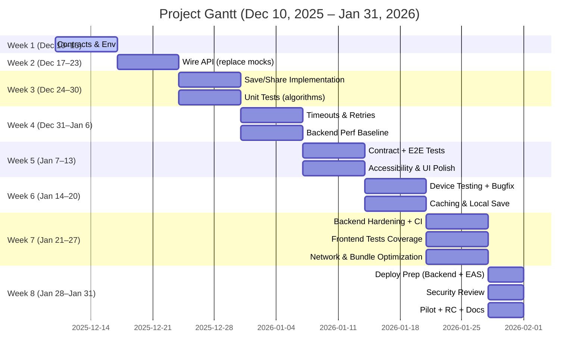

# Project Plan: Dec 10, 2025 – Jan 31, 2026

Scope: Multi-Modal Fare & Route Estimation (Frontend + Backend + Integration + Testing + Deployment + Thesis deliverables).

## Status Summary (Dec 10, 2025)
- Frontend (Expo/React Native): Structure and features largely implemented; map visualization, greedy/fuzzy logic, screens, services, docs. Known TODOs: save/share actions in `TripPlanScreen.tsx`, production readiness items (API integration, tests, error boundaries, performance, analytics, deployment).
- Backend (FastAPI + routing services): Graph, services, API modules, and tests present; GPU integration supported; needs endpoint stabilization, performance profiling, and integration with frontend.
- Documentation/Thesis: Chapters 1–3 complete (attachment). Project readmes strong; production docs and Chapters 4–5 outstanding.

## Remaining Work Areas
- Backend API integration (replace mocks, align contracts, error handling).
- Implement save/share in frontend trip planner.
- Configure keys (Maps/API), environment, and secrets management.
- Unit/integration/e2e tests across app; test device builds.
- Performance and reliability (profiling, caching, fallback paths).
- Deployment (backend service + Expo/EAS mobile builds).
- Monitoring, analytics, accessibility & UX polish.
- Thesis Chapters 4–5, results, testing, conclusion, appendices.

## Beginner Weekly To-Do Checklist (7-Day Weeks)

Each week runs for 7 days. Tasks are short, beginner-friendly, and focus on one main theme per week. Dates are inclusive.

### Week 1 (Dec 10–Dec 16)
- Create `.env` file; add backend URL and Google Maps key.
- Verify app runs on device/simulator (`npm start`).
- Write a simple note of what works/doesn’t (1 page).

### Week 2 (Dec 17–Dec 23)
- Connect `src/services/api.ts` to backend endpoints (replace mock data).
- Test “Find Routes” end-to-end for 2 sample trips.
- Add basic error messages (try/catch + toast/snackbar).

### Week 3 (Dec 24–Dec 30)
- Implement Save Trip and Share in `TripPlanScreen` (server + UI).
- Add a small success/fail message on save/share.
- Write 5 quick unit tests for `fuzzyLogic` and `greedyAlgorithm`.

### Week 4 (Dec 31–Jan 6)
- Add request timeouts and retry/backoff to API calls.
- Run backend performance baseline (CPU); note response times.
- Fix 2–3 small UI issues you notice during testing.

### Week 5 (Jan 7–Jan 13)
- Create simple contract tests (request/response shape) per endpoint.
- Record 2 E2E flows: Public Transport and Private Vehicle.
- Start basic accessibility checks (tap targets, color contrast).

### Week 6 (Jan 14–Jan 20)
- Test on a real Android/iOS device; list and fix top 5 bugs.
- Add caching/local save for recent routes and trip plans.
- Add simple logging (errors + timings) to debug issues.

### Week 7 (Jan 21–Jan 27)
- Backend hardening: validate inputs; add rate limit or basic auth.
- Set up CI to run backend tests automatically.
- Add component/screen tests to raise frontend coverage.

### Week 8 (Jan 28–Jan 31)
- Deploy staging backend (container/hosting) and set up Expo EAS builds.
- Security pass (HTTPS, CORS, no secrets); quick pilot test + feedback.
- Release candidate build + final QA list; draft Chapters 4–5 notes & appendices.

## Milestones
- Dec 21: Initial backend-frontend integration complete.
- Jan 11: Save/share features and unit tests done.
- Jan 25: Integration/E2E tests green; device testing complete.
- Jan 28: Staging deployments working; EAS build pipelines verified.
- Jan 30: Documentation + Chapters 4–5 drafts ready.
- Jan 31: Release candidate shipped; thesis materials prepared.

## Ownership & RACI (suggested)
- Frontend: UI/UX, API bindings, error boundaries, tests.
- Backend: API stability, performance, data integrity, CI.
- Integration QA: Contract tests, E2E flows, device testing.
- Docs/Thesis: Chapters 4–5, deployment/runbooks.

## Risks & Mitigations
- GPU dependency: Maintain CPU fallback paths; document setup.
- Map SDK limits: Optimize polyline rendering; simplify geometry when needed.
- Data quality: Validate segments; add sanity checks in tools/.
- Timeline slips: Keep Week 11 buffer; prioritize critical paths.

---

## Mermaid Gantt (7-day weeks)

